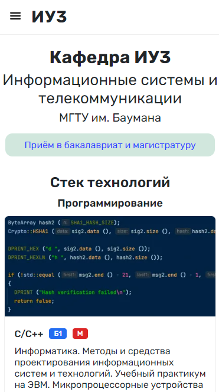
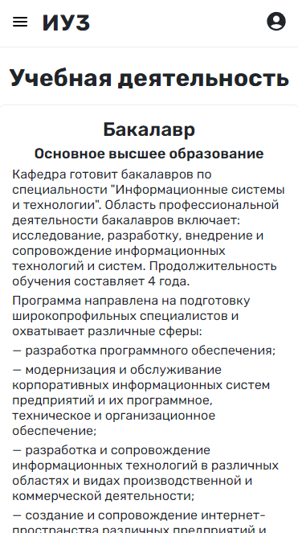
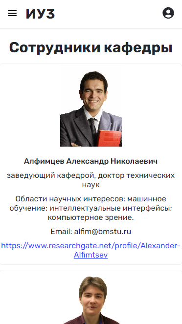
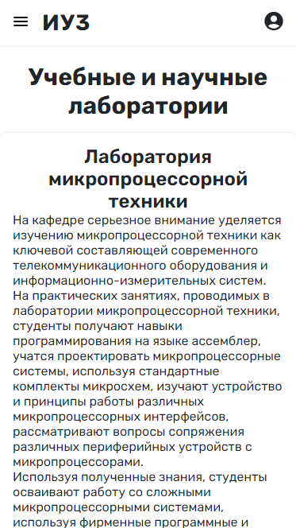
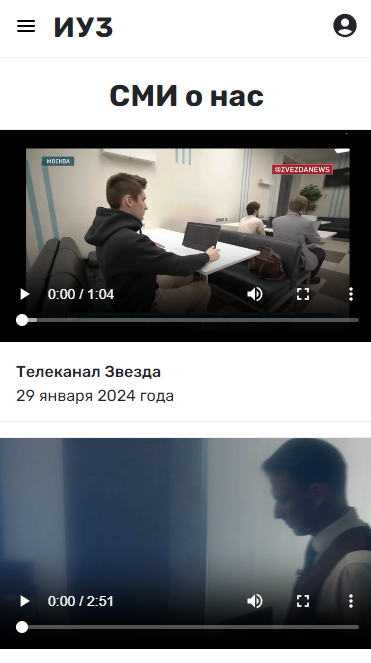
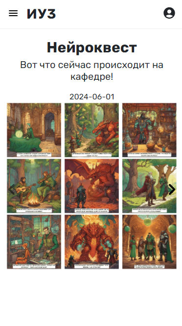
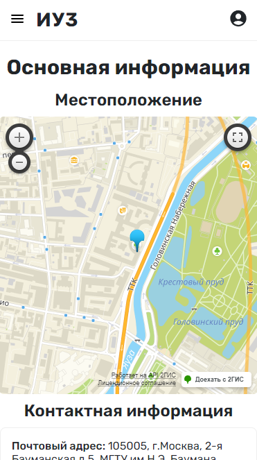

# ИУ3 (Обновлённый сайт кафедры)

<details>
  <summary>Демонстрация функционала (Desktop)</summary>
  
  
  
  
  
  
  
  
  
  
</details>

<details>
  <summary>Демонстрация функционала (Mobile)</summary>
  
  
  
  
  
  
  
  
</details>

## О проекте
Проект представляет собой обновлённую версию сайта кафедры ИУ3, разработанную в августе 2024 года. Цель проекта — обновить интерфейс и улучшить функционал текущего сайта кафедры, упростить его поддержку, лучше знакомить абитуриентов с кафедрой, её образовательными направлениями и используемыми технологиями.

## Как запустить
```bash
node src/index.js
http://localhost:8080/
```

## Основные изменения
* Единый стиль оформления: все цвета, заголовки, блоки и другие элементы сайта не различаются от страницы к странице. Это облегчает добавление новых разделов и поддержание существующих.
* Обновлённый стек технологий: для клиентской части используется Preact (облегчённая версия React), для серверной части — Express.js, в качестве базы данных — SQLite 3.
* Улучшенная адаптивность: исправлены проблемы с отображением некоторых страниц в мобильной версии.
* Улучшенная навигация: к примеру, на главной странице добавлены карточки технологий с условными обозначениями, показывающими, на каких формах обучения изучаются те или иные технологии, что упрощает понимание стека изучаемых технологий для абитуриентов.

## Что ещё предстоит реализовать
* Личный кабинет администратора сайта.
