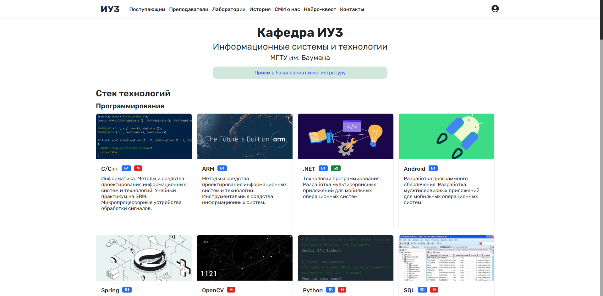

# ИУ3 (Обновлённый сайт)


*Главная страница кафедры ИУ3*

## О проекте
Проект представляет собой обновлённую версию сайта кафедры ИУ3, разработанную в августе 2024 года в рамках саморазвития навыков полного цикла разработки. Цель проекта — улучшить функциональность и адаптивность текущего сайта, упростить его поддержку и расширение, а также создать платформу, которая будет лучше знакомить потенциальных абитуриентов с кафедрой, её образовательными направлениями и используемыми технологиями.

## Как запустить
```bash
node src/index.js
```
```bash
http://localhost:8080/
```

## Основные изменения
* Обновлённый стек технологий: используется Preact (облегчённая версия React), а также Express.js и SQLite 3.
* Единый стиль оформления: теперь все цвета, заголовки, блоки и другие элементы сайта не различаются от страницы к странице. Это облегчает добавление новых разделов и поддержание существующих.
* Улучшенная адаптивность: теперь сайт полностью адаптирован для различных устройств и экранов разных размеров.
* Улучшенная навигация: например, на главной странице добавлены карточки технологий с условными обозначениями, показывающими, на каких формах обучения изучаются те или иные технологии. Это упрощает понимание информации для потенциальных абитуриентов.
* Клиентская версия и asset'ы весят меньше за счёт применения современных форматов (webp вместо jpg/png и т.д.) и современного стека технологий. Вес клиентской части сайта уменьшен в 32 раза.

## Что ещё предстоит реализовать
* Меню для мобильных устройств.
* Личный кабинет для преподавателей.
* Функционал кнопки "Приём в бакалавриат и магистратуру"
